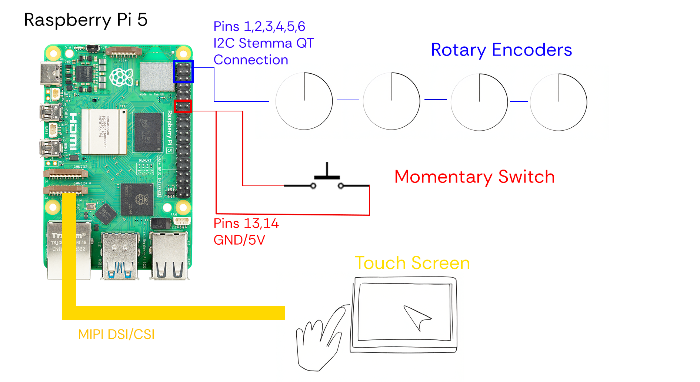

***Engineering an Embedded Network Bending Instrument, Manifesting Model Diversity in Neural Audio Synthesis***

[Click here for a video demo of Brave](https://youtu.be/0HugWkdesgw)

This repository catalogues technical development/software components of "Brave": an embedded, electro-acoustic network-bending instrument. As neural audio synthesis advances, inadvertently becoming an agent of cultural construction, we face increased risk of cultural homogenisation - autophagous AI feedback
 cycles suppressing atypical expression. The work seeks to contribute to the "network-bending" framework - the direct manipulation of internal ML architecture to promote active divergence [1] from this monolithic output. 

Through a sequence of iterative user-feedback cycles, drawing from the Proof-Of-Concept (POC) implementation of Media and Arts Technology (MAT) studies [2], I propose a user-centred, embedded network-bending device. The work, it is hoped, will benefit musicians wishing to integrate alternative ML methods into their practice, and engineers exploring embedded neural audio synthesis. To run this project, ensure necessary libraries/depencdencies are installed, see below. Run the [bash script](bashScript/braveBash.sh) - this runs the [Python script](pythonScript/braveScript.py) and launches the [Pure Data patch](pureData/bravePatch.pd).

## Embedded Network-bending

Blazej Kotowski is the first software engineer to open up the RAVE model and expose it to network-bending techniques. The artist/researcher present this work at the [Art Meets Radical Openness (AMRO) festival](https://radical-openness.org/en) in Linz, Austria. This work taps into this research, using [Kotowski’s network-bending fork](https://github.com/blazejkotowski/nn_tilde_bending) of the IRCAM [nn∼ repository](https://github.com/acids-ircam/RAVE). The decision was made to compile this work and embed it within a stand-alone instrument. The embedding is motivated by a Proof-Of-Concept (POC) exploration of embedded neural instruments, and to gauge how real-time neural synthesis can perform with current micro-computer technology. It is hoped that this POC can be scaled, motivating greater efficiency and reduced form factor as parallel processor architecture continues to advance. A Raspberry Pi 5 was chosen as the micro-computer of choice.

The most significant technical hurdle at this point was managing dependencies, ensuring libraries align with the 64-bit Arm processor, and compiling the project. The network-bending fork was opened in a CMake environment, which was used for dependency management and build generation. A compatible version of libtorch was found on [Q-engineering](https://qengineering.eu/install%20pytorch%20on%20raspberry%20pi%205.html). CMake was configured for the 64-bit arm processor architecture. 

The following code can be run in a Linux terminal to embed the network-bending fork. Note that before downloading torch and other packages, you must [activate a virtual environment](https://www.youtube.com/watch?v=DuyuAPJBEaE&t=100s). The most recent version of pure data was installed using [flathub](https://flathub.org/apps/info.puredata.Pd).

```bash
# Install dependencies
sudo apt update
sudo apt install -y cmake build-essential git puredata puredata-dev python3 python3-pip

# Download and install nn_tilde fork
# To download the original version of RAVE, change the URL
git clone https://github.com/blazejkotowski/nn_tilde_bending
cd nn_tilde_bending

# Download and install libtorch
mkdir lib
cd lib
pip3 install setuptools numpy Cython
pip3 install requests
pip3 install torch torchvision --index-url https://download.pytorch.org/whl/cpu
cd ../

# Setup Build
#TORCH_DIR must correspond to where your torch install is located
mkdir build
cd build
export Torch_DIR=../lib/libtorch/share/cmake/Torch
cmake ../src/ -DCMAKE_BUILD_TYPE=Release

# Build and copy to root dir
# Note that this root directory can be replaced with a location of your choice
make
cp frontend/puredata/nn_tilde/nn~.pd_linux ../../
```

## Networking

A networking solution is required to communicate between peripheral interface elements and the Pure Data patch. OSC communication was chosen, leveraging UDP as transport layer, maintaining the low-latency characteristics needed for live-performance. Pure Data has in built functionality for this communication protocol This is implemented with 4 digital encoders which are mapped to network-bending parameters, and a switch which can reset the model/individual layers. The Python script can be found in the Brave repository under ["braveScript.py”](pythonScript/braveScript.py).

## Computational Architecture

A Raspberry Pi 5 was selected as the micro-computer due to its 2.4GHz quad-core 64-bit Arm Cortex-A76 CPU, a [significant upgrade](https://www.pocket-lint.com/raspberry-pi-5-vs-4/) from the Raspberry Pi 4, and the possibility to upgrade to 8GB of RAM. A fan was installed as an active cooling mechanism to prevent thermal throttling - the patch is highly intensive on the CPU/RAM. The Raspberry Pi 5 DAC+ was installed, using the Texas Instruments PCM5122 DAC to deliver stereo analogue audio to a dedicated headphone amplifier, supporting 24‑bit 192kHz high-resolution digital audio. The DAC uses pass-through pins, meaning the peripheral interface elements were still able to attach to the GPIO pins.

The Adafruit I2C QT Rotary Encoder breakout was used with a standard 24-pulse encoder. This uses the I2C Stemma QT communication protocol - a variant of the I2C protocol developed by Adafruit. The protocol uses JST SH 6-pin connectors and cables, allowing easy daisy-chaining of multiple devices without soldering. This reduces wiring complexity and minimises the use of GPIO pins. Pins 1-6 were used to establish this connection. A momentary button switch was connected to pins 13 and 14 (GND/5V). Finally, the Waveshare 4.3 inch DSI capacitive touchscreen LCD was attached via. the 4-lane MIPI DSI/CSI connector - capacitive was chosen over resistive due to higher sensitivity/UX considerations. The system diagram can be seen below:



**References**  

[1] [Broad, T., Berns, S., Colton, S., and Grierson, M. Active divergence with generative deep learning - A survey and taxonomy. CoRR abs/2107.05599 (2021).](https://www.researchgate.net/publication/353208260_Active_Divergence_with_Generative_Deep_Learning_--_A_Survey_and_Taxonomy)

[2] [Bryan-Kinns, N., and Reed, C. N. A guide to evaluating the experience of media and arts technology, 2023.](https://arxiv.org/abs/2311.07490)